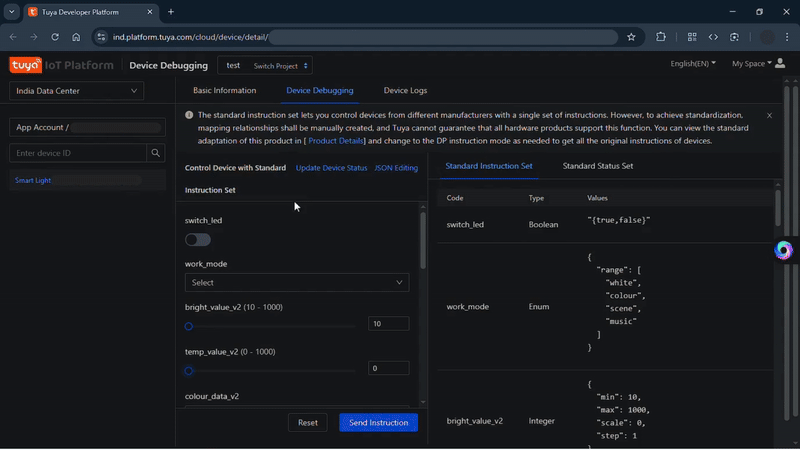

# 💡 AI Light MCP

A local MCP (Model Context Protocol) server for controlling Wipro smart bulbs using Node.js and AI tools like Claude or VS Code.

---

## 📚 Table of Contents

- [Features](#-features)
- [Prerequisites](#-prerequisites)
- [Project Structure](#-project-structure)
- [Installation](#-installation)
- [Setup](#️-setup)
- [Environment Variables](#-environment-variables)
- [Contributing](#-contributing)
- [Acknowledgments](#-acknowledgments)
- [Resource](#-resource)
- [License](#-license)

---

## ✨ Features

- 🧠 Integrates with VsCode or Claude desktop via MCP
- 💡 Control Wipro smart bulbs over `Tuya API`
- ⚙️ Easily configurable through `.env` and MCP config files
- 🔌 Local-only and secure — no cloud required
- 🛠️ Modular and extendable for other IoT devices

---

## 📋 Prerequisites

- ##### 📦 [NodeJS](https://nodejs.org/en/download) (v18 or later recommended)
- ##### 📱 Smart Life ([IOS](https://apps.apple.com/us/app/smart-life-smart-living/id1115101477)/[Android](https://play.google.com/store/apps/details?id=com.tuya.smartlife&hl=en_IN))
- ##### 💡 Wipro Bulb

---

## 📁 Project Structure

```bash
ai-light-mcp/
├── .git/ # Git version control
├── .vscode/
│ └── mcp.json # MCP configuration for local dev tools
├── dist/ # Compiled JavaScript files (build output)
├── node_modules/ # Node.js dependencies
├── src/ # TypeScript source files
│ ├── env.ts # Environment loader or helpers
│ ├── index.ts # Entry point for the MCP server
│ └── service.ts # Core logic for bulb control
├── types/ # Type definitions (global or shared)
│ └── service.type.ts # Custom type declarations
├── .env # Local environment variables (not committed)
├── .gitignore # Files/folders to ignore in Git
├── package-lock.json # NPM lockfile for reproducible installs
├── package.json # Project metadata, scripts, dependencies
├── README.md # Documentation (you’re reading it!)
└── tsconfig.json # TypeScript configuration

```

---

## 📦 Installation

Clone the repo:

```bash
git clone https://github.com/TheRedBandiCoot/ai-light-mcp.git
cd ai-light-mcp
npm install
```

---

## ⚙️ Setup

#### 1. Create `.env` file in your root directory

#### 2. Setup `Tuya` Cloud service for control the bulb

- Head Over [Tuya Website](https://www.tuya.com/) &rightarrow; <b>Developer Platform</b> (<i>Use `Ctrl + F` for search for <u>Developer Platform</u></i>).
- Sign Up / LogIn with existing account.
- After Successfully Login Head over to [Cloud Project](https://platform.tuya.com/cloud/).
- `Create Cloud Project` for create a new cloud project.
  - `Project Name` - Enter your project name `e.g. ai-mcp-bulb`
  - `Description` - Project description `Optional`
  - `Industry` - `Smart Home`
  - `Development Method` - `Custom`
  - `Data Center` - `India Data Center`
    - _Tuya deploys six data centers globally and provides reliable IoT cloud services for customers worldwide. You can select one or more data centers where your services are deployed. This setting can be changed later._
  - `Configuration Wizard` - select **4 API Service(s)** | \*_Remove rest_
    - `IoT Core` `Smart Home Basic Service` `Device Status Notification` `Industry Basic Service` (If you didn't find it try to search `Ctrl + F`).
    - After selecting `Authorize`
      - **Remember** if you `skip` it don't worry you can add it later
        - `Service API` &rightarrow; `Go Authorize`
  - After you redirect to the **Main Dashboard** of your project **_first thing first_** change the `Guide Mode` from `Industry` to `Smart Home` (If you didn't find it try to search `Ctrl + F`)
  - Now head over to `Devices`. Under `All Devices` as you can see no device right now available because we haven't setup yet.
    - Go to `Link App Account`. select `Add App Account` for adding your **_Smart Life App_** to authorize. Now [setup your Smart Life App](#3-setup-smart-life-app-in-your-phone) in your phone and follow next step from here.
  - A `⛶ QR Code` popup for scan it using **_Smart Life App_**.
  - After permission confirmation from phone in **_dashboard_** `Device Linking Method` &rightarrow; `Automatic Link (Recommended)`.
  - Now Head over to `All Devices` - (Now you can see `Device Name` `Device ID` `Device Permission` `Operation`)

#### 3. Setup `Smart Life App` in your phone📱

- Sign Up / LogIn with existing account.
- Now pair your smart bulb and add this device. (click `+` &rightarrow; `Add Device` - app search for your bulb - **_make sure you turn on/off the bulb simultaneously for 7-8 times for reset/pair mode on_**)
- After the light setup head over to `profile🙎🏻‍♂️` open `⛶ QR Scanner`
- Scan the `⛶ QR provide` from `Add App Account` QR.
- After scan `Confirm` it from phone for granted permission.

#### 4. Control the Smart Light from Tuya Dashboard

- In your Dashboard Head over to `Devices` &rightarrow; `All Devices` &rightarrow; `Device Permission` (Search It `Ctrl + F` if you don't find it)
  - Change `Device Permission` from `Read` To `Controllable` - Refresh the page to see the changes.
- Now go to `Operation` &rightarrow; `Debug Device`
  - Here under `Basic Information` &rightarrow; `Extension Information` &rightarrow; `IP Address`
    - Note down the `IP Address` for **\*Allow Cloud Authorization IP** (_We do it later_)
  - ##### <span style="color:lightgreen">ENV 1</span> - **_`Device ID`_**
    - `Basic Information` &rightarrow; `Device Information` &rightarrow; `Devise ID`
  - For control the light go to `Device Debugging`
     <details>
      <summary>
        Here is the video demonstration How it work
      </summary>
      
     
    </details>

#### 5. Allow Cloud Authorization IP

- In your project _Dashboard_ under `Overview` - _Toggle_ `Cloud Authorization IP Allowlist`
  - `configure IP whitelist` - Add your device IP. (Previously Mention From where IP Address Locate - Head Over to [Control the Smart Light from Tuya Dashboard](#4-control-the-smart-light-from-tuya-dashboard)) section

#### 6. Authorization Key

- In your _Project Dashboard_ &rightarrow; _Overview_ &rightarrow; `Authorization Key`
  - ##### <span style="color:lightgreen">ENV 2 & 3</span> - **_`Access ID/Client ID`_** **_`Access Secret/Client Secret`_**

---

## 🌿 Environment Variables

| Sl.   | Name                        | locate                                                                                                                  |
| ----- | --------------------------- | ----------------------------------------------------------------------------------------------------------------------- |
| ENV 1 | Device ID                   | `Project Dashboard` &rightarrow; `Devices` &rightarrow; `All Devices` &rightarrow; `Device ID`                          |
| ENV 2 | Access ID/Client ID         | `Project Dashboard` &rightarrow; `Overview` &rightarrow; `Authorization Key` &rightarrow; `Access ID/Client ID`         |
| ENV 3 | Access Secret/Client Secret | `Project Dashboard` &rightarrow; `Overview` &rightarrow; `Authorization Key` &rightarrow; `Access Secret/Client Secret` |
| EVN 4 | BASE_URL                    | [`🔗https://openapi.tuyain.com🔗`](https://github.com/tuya/tuya-connector-Nodejs)                                       |

---

## 5. Final Setup (Build & MCP Setup)

- After Env setup Now its time for build
  ```bash
  $ npm run build
  ```
- Go to `.vscode/mcp.json` and `start` the server.

```bash
[server stderr] Wipro Smart Bulb MCP Server Is Running
[info] Discovered 3 tools
```

#### Now Head over to coplot and ask copilot agent to do task like

- `Turn On Light` `Light color change to blue` `Light off`
- make sure to allow permission for tools to get work done

---

## 🤝 Contributing

- Pull requests are welcome! For major changes, open an issue first to discuss what you'd like to change.

---

## 🙌 Acknowledgments

- Inspired by [Piyush Garg | MCP Server for Smart Bulb with Claude](https://www.youtube.com/watch?v=bWFWeolDGcM)

---

## 📚 Resource

- [Tuya Developer Platform](https://developer.tuya.com/en/docs/iot) &rightarrow; [Cloud Development](https://developer.tuya.com/en/docs/iot/introduction-to-tuya-iot-platform?id=Ka6vijvqb3uhn) &rightarrow; [Standard Instruction Set](https://developer.tuya.com/en/docs/iot/standarddescription?id=K9i5ql6waswzq) &rightarrow; [Lighting](https://developer.tuya.com/en/docs/iot/lighting?id=Kaiuyzxq30wmc) &rightarrow; [Light (dj)](https://developer.tuya.com/en/docs/iot/categorydj?id=Kaiuyzy3eheyy) &rightarrow; [Instruction Set: dj](https://developer.tuya.com/en/docs/iot/dj?id=K9i5ql3v98hn3)
- [Tuya Developer Platform](https://developer.tuya.com/en/docs/iot) &rightarrow; [SDK Reference](https://developer.tuya.com/en/docs/iot/sdk-reference?id=Kbd2uhl6cbha1)
  - [`🔗Node.js SDK for Cloud Development Github Repo🔗`](https://github.com/tuya/tuya-connector-Nodejs)

---

## 📝 License

- Copyright (c) Microsoft Corporation. All rights reserved.
- Licensed under the [MIT](LICENSE.txt) license.
